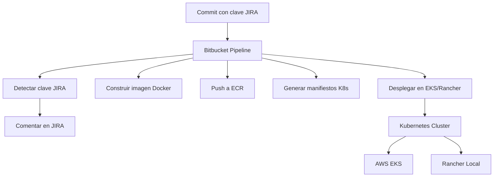

# 🚀 CI/CD Pipeline con Bitbucket, JIRA, Docker y Kubernetes

## 📖 Tabla de Contenidos

- [📋 Descripción General](#-descripción-general)
- [🏗️ Arquitectura del Sistema](#️-arquitectura-del-sistema)
- [⚙️ Configuración Requerida](#️-configuración-requerida)
- [📁 Estructura del Repositorio](#-estructura-del-repositorio)
- [🎯 Pipelines Disponibles](#-pipelines-disponibles)

## 🛠️ MÓDULOS

### 🔗 Integración con JIRA
- [Scripts JIRA](#-scripts-jira)
- [Configuración](#-configuración-jira)
- [Ejemplos de Uso](#-ejemplos-de-uso-jira)
- [Solución de Problemas](#-solución-de-problemas-jira)

### 🐳 Docker y ECR
- [Scripts Docker](#-scripts-docker)
- [Manifiestos](#-manifiestos-docker)
- [Ejemplos de Uso](#-ejemplos-de-uso-docker)
- [Solución de Problemas](#-solución-de-problemas-docker)

### ☸️ Kubernetes (EKS & Rancher)
- [Scripts Kubernetes](#-scripts-kubernetes)
- [Templates](#-templates-kubernetes)
- [Ejemplos de Uso](#-ejemplos-de-uso-kubernetes)
- [Solución de Problemas](#-solución-de-problemas-kubernetes)

### 🔄 Pipelines Bitbucket
- [Pipeline Completo](#-pipeline-completo)
- [Ejecución Manual](#-ejecución-manual)
- [Variables de Entorno](#-variables-de-entorno)

---

<<<<<<< HEAD
## 📋 Descripción General

Sistema de CI/CD completo que integra Bitbucket Pipelines con JIRA, Docker y Kubernetes (AWS EKS y Rancher Local). Automatiza desde la detección de issues en commits hasta el despliegue en producción.

## 🏗️ Arquitectura del Sistema



## ⚙️ Configuración Requerida

### Prerrequisitos
- ✅ Cuenta de Bitbucket con Pipelines habilitado
- ✅ Proyecto en JIRA con API access
- ✅ Cluster Kubernetes (EKS o Rancher)
- ✅ Repositorio ECR en AWS (para EKS)
- ✅ AWS CLI configurado (para EKS)

### Variables de Entorno
Configurar en Bitbucket > Repository settings > Variables:

```bash
# JIRA
JIRA_BASE_URL=https://tu-empresa.atlassian.net
JIRA_USERNAME=tu@email.com
JIRA_API_TOKEN=tu_token

# AWS EKS
AWS_ACCESS_KEY_ID=AKIA...
AWS_SECRET_ACCESS_KEY=secret
AWS_ACCOUNT_ID=123456789012
AWS_REGION=us-east-1
EKS_CLUSTER_NAME=mi-cluster
CERTIFICATE_ARN=arn:aws:acm:...

# Application
APP_NAME=mi-aplicacion
APP_PORT=3000
DOMAIN=mi-dominio.com

# Database
DB_USER=usuario
DB_HOST=bd.midominio.com
DB_NAME=basedatos

# Secrets (codificados en base64)
DB_PASSWORD_B64=$(echo -n "password" | base64)
API_KEY_B64=$(echo -n "api-key" | base64)
```

## 📁 Estructura del Repositorio

```
repo/
├── bitbucket-pipelines.yml
├── .env.example
├── kubernetes-manifests/
│   ├── templates/
│   │   ├── deployment.yaml.tpl
│   │   ├── service.yaml.tpl
│   │   ├── configmap.yaml.tpl
│   │   ├── secret.yaml.tpl
│   │   ├── hpa.yaml.tpl
│   │   └── ingress.yaml.tpl
│   ├── overlays/
│   │   ├── aws-eks/
│   │   └── rancher-local/
│   └── generated/
├── scripts/
│   ├── jira/
│   │   ├── detect-jira-keys.sh
│   │   └── comment-jira.sh
│   ├── docker/
│   │   ├── build-image.sh
│   │   └── push-to-ecr.sh
│   ├── kubernetes/
│   │   ├── generate-manifests.sh
│   │   ├── deploy.sh
│   │   ├── deploy-to-eks.sh
│   │   └── deploy-to-rancher.sh
│   └── utils/
│       └── setup.sh
└── app/
    └── index.js
```

## 🎯 Pipelines Disponibles

### Pipelines Automáticos
- **main**: Build + ECR Push + Deploy to EKS
- **develop**: Build + Deploy to Rancher

### Pipelines Manuales
- `jira-pipeline`: Comentar manualmente en JIRA
- `docker-pipeline`: Solo build y push de imagen
- `eks-deploy`: Deploy manual a EKS
- `rancher-deploy`: Deploy manual a Rancher
- `full-pipeline`: Proceso completo end-to-end

---

## 🔗 INTEGRACIÓN CON JIRA

### 📋 Scripts JIRA

#### `scripts/jira/detect-jira-keys.sh`
**Propósito**: Detectar claves JIRA en mensajes de commit y comentar automáticamente.

**Funcionalidades**:
- ✅ Escanea el último commit en busca de patrones PROJ-123
- ✅ Filtra duplicados y múltiples claves
- ✅ Ejecuta comentarios automáticos en cada issue detectado
- ✅ Genera reporte de éxito/error

**Variables Requeridas**:
```bash
JIRA_BASE_URL
JIRA_USERNAME  
JIRA_API_TOKEN
```

#### `scripts/jira/comment-jira.sh`
**Propósito**: Comentar manualmente en una incidencia JIRA específica.

**Uso**:
```bash
./scripts/jira/comment-jira.sh "PROJ-123" "Mensaje personalizado"
```

### ⚙️ Configuración JIRA

1. **Crear API Token**:
   - Ve a https://id.atlassian.com/manage-profile/security/api-tokens
   - Crea un nuevo token
   - Guarda el token de forma segura

2. **Permisos de Usuario**:
   - El usuario debe tener permisos para comentar en los proyectos
   - Verificar permisos en JIRA > Project settings > Permissions

### 🚀 Ejemplos de Uso JIRA

#### Commit con detección automática:
```bash
git commit -m "PROJ-123: Fix critical security vulnerability"
git push origin main
# → Comentario automático en PROJ-123
```

#### Múltiples issues en un commit:
```bash
git commit -m "PROJ-123 and PROJ-456: Update dependencies and fix UI issues"
# → Comentarios en PROJ-123 y PROJ-456
```

### ❌ Solución de Problemas JIRA

#### Error 401: Unauthorized
```bash
❌ Error: 401 - Invalid authentication credentials
```
**Solución**:
- Verificar JIRA_USERNAME y JIRA_API_TOKEN
- Asegurar que el token no haya expirado
- Verificar permisos del usuario

#### Error 404: Not Found
```bash
❌ Error: 404 - Issue not found
```
**Solución**:
- Verificar que la clave del issue exista
- Confirmar que el usuario tenga acceso al proyecto

#### No detecta claves
```bash
⚠️ No se encontraron claves JIRA en el mensaje de commit
```
**Solución**:
- Usar formato correcto: PROJ-123, ABC-456
- Las claves deben estar en mayúsculas

---

## 🐳 DOCKER Y ECR

### 📋 Scripts Docker

#### `scripts/docker/build-image.sh`
**Propósito**: Construir imagen Docker de la aplicación.

**Funcionalidades**:
- ✅ Construye imagen con tag del build number
- ✅ Soporta multi-stage builds
- ✅ Cache optimizado para builds rápidos
- ✅ Validación de Dockerfile

#### `scripts/docker/push-to-ecr.sh`  
**Propósito**: Subir imagen Docker a AWS ECR.

**Funcionalidades**:
- ✅ Login automático a ECR
- ✅ Tagging de imágenes con versionado
- ✅ Push a repositorio ECR
- ✅ Verificación de push exitoso

### 📋 Manifiestos Docker

#### `Dockerfile` Ejemplo:
```dockerfile
FROM node:18-alpine AS builder
WORKDIR /app
COPY package*.json ./
RUN npm ci --only=production

FROM node:18-alpine
WORKDIR /app
COPY --from=builder /app/node_modules ./node_modules
COPY app/ .
EXPOSE 3000
USER node
CMD ["node", "index.js"]
```

### 🚀 Ejemplos de Uso Docker

#### Build local:
```bash
./scripts/docker/build-image.sh
# → Construye imagen con tag latest
```

#### Build con tag específico:
```bash
IMAGE_TAG="v1.2.3" ./scripts/docker/build-image.sh
```

#### Push a ECR:
```bash
./scripts/docker/push-to-ecr.sh
# → Sube imagen a ECR
```

### ❌ Solución de Problemas Docker

#### Error: Docker daemon not running
```bash
❌ Cannot connect to the Docker daemon
```
**Solución**:
- Verificar que Docker esté instalado
- En Bitbucket: asegurar que el servicio docker esté en el step

#### Error: ECR login failed
```bash
❌ Unable to locate credentials
```
**Solución**:
- Verificar AWS_ACCESS_KEY_ID y AWS_SECRET_ACCESS_KEY
- Confirmar permisos del usuario IAM para ECR

#### Error: Image push failed
```bash
❌ denied: repository does not exist
```
**Solución**:
- Crear repositorio ECR manualmente
- Verificar que el usuario IAM tenga permisos ECR:Push

---

## ☸️ KUBERNETES (EKS & RANCHER)

### 📋 Scripts Kubernetes

#### `scripts/kubernetes/generate-manifests.sh`
**Propósito**: Generar manifiestos Kubernetes desde templates.

**Funcionalidades**:
- ✅ Procesa templates con variables de entorno
- ✅ Soporta múltiples entornos (dev, staging, production)
- ✅ Genera configuración específica por plataforma
- ✅ Output consistente y versionado

#### `scripts/kubernetes/deploy-to-eks.sh`
**Propósito**: Desplegar aplicación en AWS EKS.

**Funcionalidades**:
- ✅ Configura automáticamente kubectl para EKS
- ✅ Aplica manifiestos generados
- ✅ Espera por rollout completion
- ✅ Verificación de estado del deployment

#### `scripts/kubernetes/deploy-to-rancher.sh`
**Propósito**: Desplegar aplicación en Rancher Local.

**Funcionalidades**:
- ✅ Soporta múltiples contextos de Kubernetes
- ✅ Despliegue en clusters locales
- ✅ Configuración flexible de registry

### 📋 Templates Kubernetes

#### `templates/deployment.yaml.tpl`
```yaml
apiVersion: apps/v1
kind: Deployment
metadata:
  name: {{APP_NAME}}
  labels:
    app: {{APP_NAME}}
    environment: {{ENVIRONMENT}}
spec:
  replicas: {{REPLICAS}}
  template:
    spec:
      containers:
      - name: {{APP_NAME}}
        image: {{IMAGE_REPO}}:{{IMAGE_TAG}}
        ports:
        - containerPort: {{APP_PORT}}
```

#### `templates/ingress.yaml.tpl`
```yaml
apiVersion: networking.k8s.io/v1
kind: Ingress
metadata:
  name: {{APP_NAME}}-ingress
  annotations:
    kubernetes.io/ingress.class: {{INGRESS_CLASS}}
spec:
  rules:
  - host: {{APP_NAME}}.{{DOMAIN}}
    http:
      paths:
      - path: /
        backend:
          service:
            name: {{APP_NAME}}-service
            port: { number: 80 }
```

### 🚀 Ejemplos de Uso Kubernetes

#### Despliegue en EKS:
```bash
./scripts/kubernetes/deploy-to-eks.sh my-app production v1.0.0
```

#### Despliegue en Rancher:
```bash
./scripts/kubernetes/deploy-to-rancher.sh my-app dev latest
```

#### Generar manifiestos only:
```bash
./scripts/kubernetes/generate-manifests.sh
# → Genera manifests en kubernetes-manifests/generated/
```

### ❌ Solución de Problemas Kubernetes

#### Error: kubectl not configured
```bash
❌ The connection to the server was refused
```
**Solución**:
- Configurar AWS CLI para EKS
- Para Rancher: verificar que el contexto esté configurado

#### Error: ImagePullBackOff
```bash
❌ Failed to pull image
```
**Solución**:
- Verificar que la imagen exista en el registry
- Confirmar permisos de pull para el service account

#### Error: Invalid manifest
```bash
❌ error validating data
```
**Solución**:
- Verificar templates con `kubectl apply --dry-run=client`
- Validar variables requeridas

#### Error: Ingress not working
```bash
❌ No ingress controllers found
```
**Solución**:
- Instalar ingress controller (nginx o ALB)
- Verificar annotations del ingress

---

## 🔄 PIPELINES BITBUCKET

### 📋 Pipeline Completo

#### `bitbucket-pipelines.yml`
**Flujo Completo CI/CD**:
1. ✅ Detección de claves JIRA en commits
2. ✅ Build de imagen Docker
3. ✅ Push a AWS ECR
4. ✅ Generación de manifiestos Kubernetes
5. ✅ Deploy a EKS/Rancher
6. ✅ Notificación en JIRA

### 🚀 Ejecución Manual

#### Desde Bitbucket UI:
1. **Pipelines** → **Run pipeline**
2. Seleccionar pipeline deseado:
   - `eks-deploy` → Deploy a EKS
   - `rancher-deploy` → Deploy a Rancher
   - `full-pipeline` → Proceso completo

#### Variables por Pipeline:
```yaml
eks-deploy:
  variables:
    - APP_NAME: "mi-app"
    - DEPLOY_ENV: "staging" 
    - IMAGE_TAG: "$BITBUCKET_BUILD_NUMBER"
```

### ⚙️ Variables de Entorno

#### Variables Requeridas:
```bash
# JIRA
JIRA_BASE_URL="https://your-company.atlassian.net"
JIRA_USERNAME="user@company.com"
JIRA_API_TOKEN="your-api-token"

# AWS
AWS_ACCESS_KEY_ID="AKIA..."
AWS_SECRET_ACCESS_KEY="your-secret-key"
AWS_ACCOUNT_ID="123456789012"
AWS_REGION="us-east-1"

# App
APP_NAME="your-app-name"
APP_PORT="3000"
DOMAIN="your-domain.com"
```

#### Configurar en Bitbucket:
1. Repository **Settings** → **Variables**
2. Agregar cada variable
3. Marcar como **Secured** las sensibles

### ❌ Solución de Problemas Pipelines

#### Error: Pipeline failed
```bash
❌ Pipeline execution failed
```
**Solución**:
- Revisar logs del pipeline paso a paso
- Verificar variables de entorno configuradas

#### Error: Timeout
```bash
❌ Execution timed out
```
**Solución**:
- Aumentar timeout en configuración del step
- Optimizar steps largos

#### Error: Permission denied
```bash
❌ Permission denied (publickey)
```
**Solución**:
- Verificar SSH keys en Bitbucket
- Configurar deploy keys si es necesario

---

## 🚀 GUÍA DE IMPLEMENTACIÓN RÁPIDA

### 1. Configuración Inicial
```bash
# Clonar repositorio
git clone <your-repo>
cd <your-repo>

# Configurar variables de entorno
cp .env.example .env
# Editar .env con tus valores
```

### 2. Configurar Bitbucket
1. **Repository Settings** → **Variables**
2. Agregar todas las variables del .env
3. Marcar como **Secured** las sensibles

### 3. Primer Deploy
```bash
# Commit inicial
git add .
git commit -m "PROJ-123: Initial deployment setup"
git push origin main

# O ejecutar manualmente desde Bitbucket UI
# → Pipelines → Run pipeline → full-pipeline
```

### 4. Verificar Despliegue
```bash
# Verificar pods
kubectl get pods -n <environment>

# Verificar servicios
kubectl get svc -n <environment>

# Verificar ingress
kubectl get ingress -n <environment>

# Verificar en JIRA
# → El issue debe tener comentario automático
```

## 📞 SOPORTE Y TROUBLESHOOTING

### Logs de Depuración
```bash
# Ver logs completos del pipeline
kubectl logs -f deployment/<app-name> -n <environment>

# Debug de templates
./scripts/kubernetes/generate-manifests.sh
kubectl apply -f generated/ --dry-run=client

# Ver variables de entorno
echo $APP_NAME
echo $AWS_REGION
```

### Enlaces Útiles
- [Bitbucket Pipelines Docs](https://support.atlassian.com/bitbucket-cloud/docs/get-started-with-bitbucket-pipelines/)
- [JIRA REST API Docs](https://developer.atlassian.com/cloud/jira/platform/rest/v3/intro/)
- [AWS EKS Docs](https://docs.aws.amazon.com/eks/latest/userguide/getting-started.html)
- [Kubernetes Docs](https://kubernetes.io/docs/home/)

---

## 📝 LICENCIA

Este proyecto es de uso libre para implementaciones internas. Asegúrate de cumplir con las políticas de seguridad de tu organización.

## 🤝 CONTRIBUCIONES

Las contribuciones son bienvenidas. Por favor:

1. Fork el proyecto
2. Crea una feature branch
3. Commit tus cambios
4. Push a la branch
5. Abre un Pull Request

## 📧 SOPORTE

Para problemas técnicos:
1. Revisar la sección de troubleshooting correspondiente
2. Verificar logs de ejecución
3. Revisar variables de entorno configuradas

Para mejoras o features nuevas:
- Abrir un issue en el repositorio
- Describir el use case específico

---

**¡Despliegue exitoso! 🚀**
=======
**Estado**: ✅ Funcional  
**Última Actualización**: 29/08/2025
**Versión**: 1.0
>>>>>>> bae88575c24479a25b33ef6f9e36c695a1e2d5df
